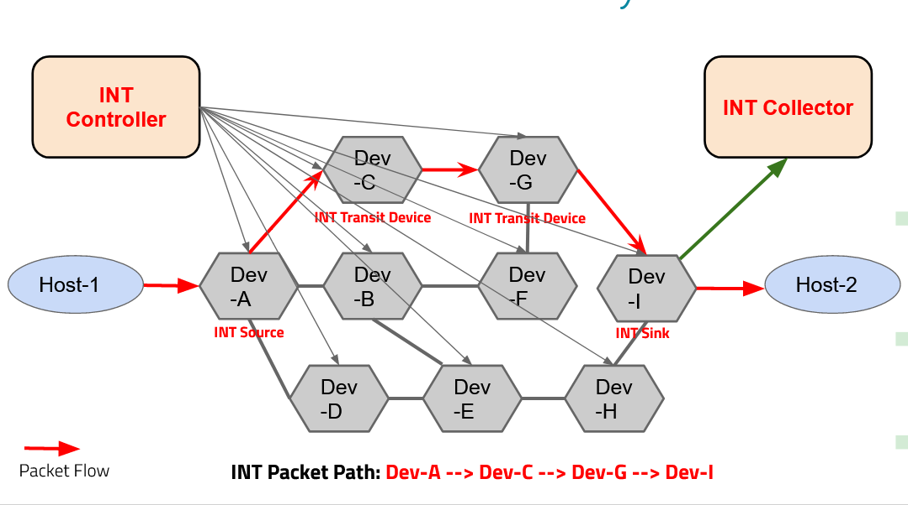

# Cisco Internship Inband-Network Telemetry Collector

### What is this program?

<p align="center"></p>

Inband Network Telemetry (“INT”) is a framework designed to allow the collection and reporting of network state, by the data plane, without requiring intervention or work by the control plane. This, in effect, allows for faster monitoring of the network state which subsequently allows for faster packet routing than traditional methods allow.


The INT Collector is a program that parses an INT packet that is sent from client to server. The INTTestClient program sends the packet to the INTCollector program and then parses it and isolates its various headers including the INT header.


### Installation Instructions

Only One module is required for the Collector program to run

to install it, run these commands:

```sh

pip install bitstring

```

### Running Information

to run the program, go to the directory in your terminal and type in:

```sh

python INTCollector.py

```

open another terminal and type in:

```sh

python INTTestClient.py

```

Follow the on-screen prompts
