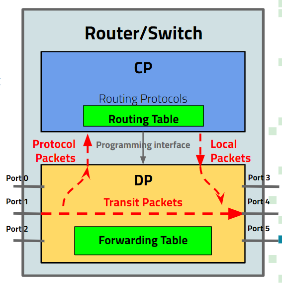

# Cisco Internship Inband-Network Telemetry Collector

### What is this program?

To understand this program, one needs to have an understanding of traditional packet routing. The Control Plane is responsible for managing and populating the Routing Table which contains mapping between packet’s destinations and ports. It consists of programs running routing protocols that decipher the protocol packets exchanged between routers and switches in the network and fill the Routing Table. Information from the Routing Table is fed into the Forwarding Table in Data plane over a programming interface that connects the Control Plane with Data Plane. The Data Plane is primarily responsible to transfer packets from an input port to an output port by looking up entries/rules in Forwarding table based on packet’s destination.

<p align="center"></p>

Inband Network Telemetry (“INT”) is a framework designed to allow the collection and reporting of network state, by the data plane, without requiring intervention or work by the control plane. This, in effect, allows for faster monitoring of the network state which subsequently allows for faster packet routing than traditional methods allow.


The INT Collector is a program that parses an INT packet that is sent from client to server. The INTTestClient program sends the packet to the INTCollector program and then parses it and isolates its various headers including the INT header.


### Installation Instructions

Only One module is required for the Collector program to run

to install it, run these commands:

```sh

pip install bitstring

```

### Running Information

to run the program, go to the directory in your terminal and type in:

```sh

python INTCollector.py

```

open another terminal and type in:

```sh

python INTTestClient.py

```

Follow the on-screen prompts
