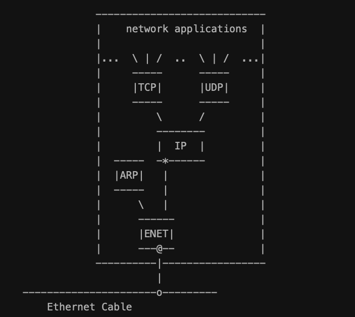
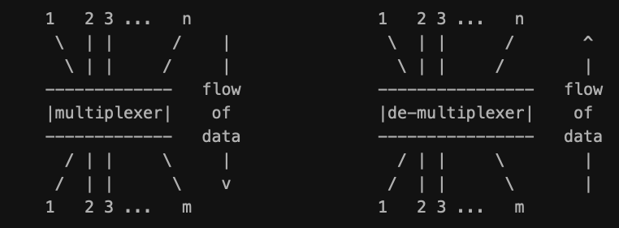
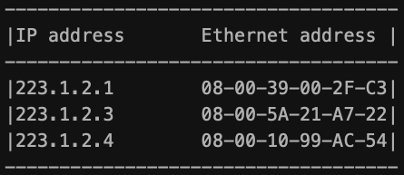
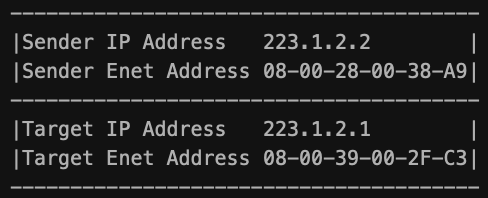
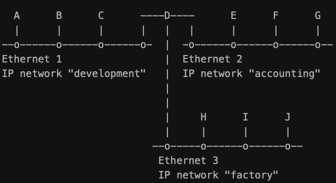

# __TCP/IP__

### Steps in forwarding an IP datagram from source host to destination host through a router

## TCP/IP Overview
- Term "TCP/IP"
    - Anything related to the specific protocols of TCP and IP
    - Protocols, applications, and network medium
    - Sample protocols: UDP, ARP, and ICMP
    - Sample applications: TELNET, FTP, and rcp
- Structure 

    - Structure of the layered protocols inside a computer on an internet
    - **Boxes are the processing of the data as it passes through the computer**
    - **Lines connecting the boxes show the path of data**
    - **Horizontal line at bottom is the Ethernet cable**
    - **"o" is the transceiver**
    - **"*" is the IP address and "@" is the Ethernet address.**
- Terms
    - Unit of data on Ethernet -> Ethernet frame
    - Between Ethernet driver and IP module -> IP packet
    - Between IP module and UDP module -> UDP datagram
    - Between IP module and TCP module -> TCP segment (a transport message)
    - In network application -> application message
    - **Driver:** is software that communicates directly with the network
   interface hardware.  
   - **Module:** software that communicates with a
   driver, with network applications, or with another module.
- Flow of Data
    - FTP (FileTransfer Protocol) is a typical application that uses TCP
        - Protocol stack: FTP/TCP/IP/ENET.
    - Multiplexers switch many inputs to one output. De-multi are opposite 

- Two Network Interfaces 

    - Computers with more than one physical network interface, the IP module is both a multiplexer and de-multiplexer
    - Performs multiplexing in both directions to accommodate incoming and outgoing data: 

    - It can forward data onto the next network and data can arrive on any network interface and be sent out to any other
    - **"Forwarding" an IP Packet** is the process of sending an IP packet out onto another network
    - **"IP-router"** is a computer that has been dedicated the task of forwarding IP packets
- IP creates a Single Logical Network
    - **IP header** contains the IP address, which builds a single logical network from multiple physical networks.
        - This interconnection is called the internet: a set of physical networks that limit the range of an IP packet
- Physical Network Independence
    - Takeaway: IP hides the underlying network hardware form the network applications so they are not vulnerable to changes in hardware tech
- Interoperability
    - **"Interoperate"** is when two computers on an internet communicate
    - **"Interoperability"** is when the implementation of internet tech is good

## Ethernet
- Ethernet frame contains destination address, source address, type field, and data
- Address is 6 bytes, every device has its own address and listens for frames with that destination address
- Also listen for Ethernet frames with a "broadcast" address
- CSMA/CD (Carrier Sense and Multiple Access with Collision Detection)
    - All devices communicate on a single medium, one can transmit at a time, and all receive at the same time

## ARP
- Address Resolution Protocol is used to translate IP addresses to Ethernet addresses
    - Only for outgoing IP packets, since is is when the IP header and Ethernet headers are created
- ARP table for Address Translation 

    - Ethernet address
        - 6-byte and hexadecimal and separating with minus or colon
    - IP address
        - 4-byte with each byte in decimal separated by period
    - Cannot translate using algorithm, instead selected by the network manager based on the location of the computer on the internet
- Translation Scenario
    - Network application sends application message to TCP -> IP module
    - IP packet has been constructed and is read to be given to the Ethernet driver
        - But Ethernet address has to be determined
- ARP Request/Response Pair
    - ARP table is filled automatically by ARP on an "as-needed" basis
    - ARP table cannon be used:
        - **ARP request packet with a broadcast Ethernet address is sent out on the network to every computer**
        - **Outgoing IP packet is queued**
    - ARP request packet: 

        - Essentially says: "If your IP address matches this target IP address, then please tell me your Ethernet address"
    - ARP response packet: 

        - The ARP response packet says "Yes, that
        target IP address is mine, let me give you my Ethernet address"
    - Finally, the ARP module examines the ARP packet and adds the sender's IP and Ethernet addresses to its ARP table.
- Translation Scenario...
    - **The ARP response arrives with the IP-to-Ethernet address translation for the ARP table**
    - **For the queued IP packet, the ARP table is used to translate the IP address to the Ethernet address**
    - **The Ethernet frame is transmitted on the Ethernet**

## Internet Protocol
- Essence of IP is its route table
    - In-memory table is used to make decisions about routing an IP packet
- Direct Routing
    - When sending a packet from one computer to another, the IP headers include IP header and Ethernet header for the source and the destination
    - When the destination computer receives it, it checks the address against its own and then sends it to the upper protocols
- Indirect Routing 

    - Example above is of three IP Networks and 1 internet
    - Router to computer communication is direct routing
        - Pair of computers on the same IP network is direct routing 
    - For A to communicate with E, first it must go through D to forward the packet -> indirect routing
        - Router D realizes that destination is not D so sends to the real computer IP address: E
        - Ethernet addresses are not the same: first destination is D and then destination is E
- IP Module Routing Rules
    - **An IP entering from upper layer must send the packet directly or indirectly and must choose a lower network interface**
    - **An IP entering from lower interface must forward the packet or pass it to upper layer**
    - **An incoming IP packet that has arrived can never be forwarded back out the same network interface**
- IP Address
    - Network managers assign IP addresses to computers according to the IP network that each computer is associated with
    - For a computer with an IP address of 223.1.2.1, the network number is 223.1.2 and the host number is number 1
    - **Class C:** Upper 3 bits indicate that 21 bits are the network number and 8 bits are the host number
- Names
    - __Hosts__ file contains name-to-address translation data 

    - If larger networks then file stored on a server and accessed when needed
    - Not required for the operation of an internet, but makes it easier for people
- IP Route Table
    - IP looks up which lower network interface to use when sending a packet in the route table
    - __Route Table__
        - The primary columns
            - IP network number, direct/indirect flag, router IP address, and interface number 
        - IP refers to the table for each outgoing IP packet
    - Content of route table can be changed and is defined by the network manager

## User Datagram Protocol (UDP)
- One of two main protocols that are on top of IP
    - Offers service to network applications
    - Example: Network File System and Simple Network Management Protocol
    - Pushes the datagram out on the net and accepts incoming datagrams off the net
    - __Two Values__
        - Multiplexing of information between applications based on port number
        - Checksum to check the integrity of the data
- Ports
    - UDP ports is a path of communication between an application and UDP
    - UDP preserves the message boundary defined by the application
        - Never joins two applications messages together or divides a single application
- Checksum
    - When a UDP module receives the UDP the UDP datagram from IP, it examines the UDP checksum
    - If 0 then it was not calculated and can be ignored
    - If valid then destination port number is examined and an application message is queued for the application to read
        - Else, the datagram is discarded

## Transmission Control Protocol (TCP)
- TCP offers connection-oriented byte stream, not connectionless datagram delivery service
    - Guarantees delivery, while UDP does not
- Used by network applications that require delivery and cannot deal with time-outs and retransmissions
- Requires more CPU and network bandwidth, also internals of the module are more complicated 

## Network Applications
- TCP and UDP supply different services 
- TCP
    - Reliable stream delivery service
    - Efficiency over long-haul circuits
- UDP
    - Datagram service
    - Efficiency over fast networks with short latency
- TELNET
    - Provides a remote login capability on TCP
- FTP
    - File Transfer Protocol uses TCP
    - Allows you to copy files between computers
- rsh
    - Called remote shell and is one of an entire family of remote UNIX style commands
- NFS
    - Uses UDP and is for mounting UNIX file systems on multiple computers
- SNMP
    - Uses UDP and designed for use by central network management stations
- X-Window
    - X Window is much more than a utility for drawing windows, but rather philosophy for designing a user interface

# End __TCP/IP__